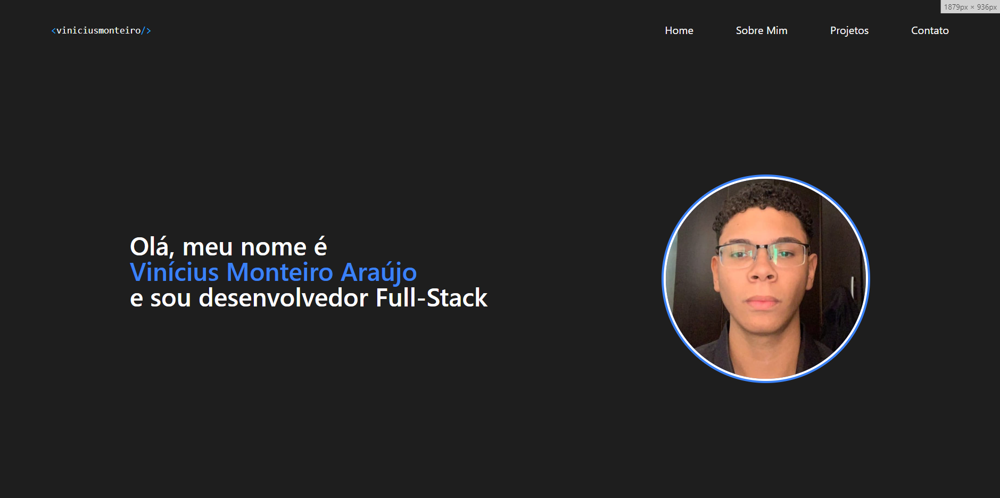

# Meu Portfólio

## [Cique Aqui](https://portfolio-react-kappa-five.vercel.app) para acessar o site
---
## Sobre 
Portfólio criado para a matéria de Web Dev.
O objetivo desse projeto é colocar em prática os conhecimentos sobre o desenvolvimentos de sites adquiridos no curso de Engenharia de Software na [FIAP](https://jandira.sp.senai.br/).

---

## Tecnologia utilizidas
- React
- CSS3
- Responsividade
- JavaScript

---

## Autor
- [Vinícius Monteiro](https://github.com/Monteiro77)
